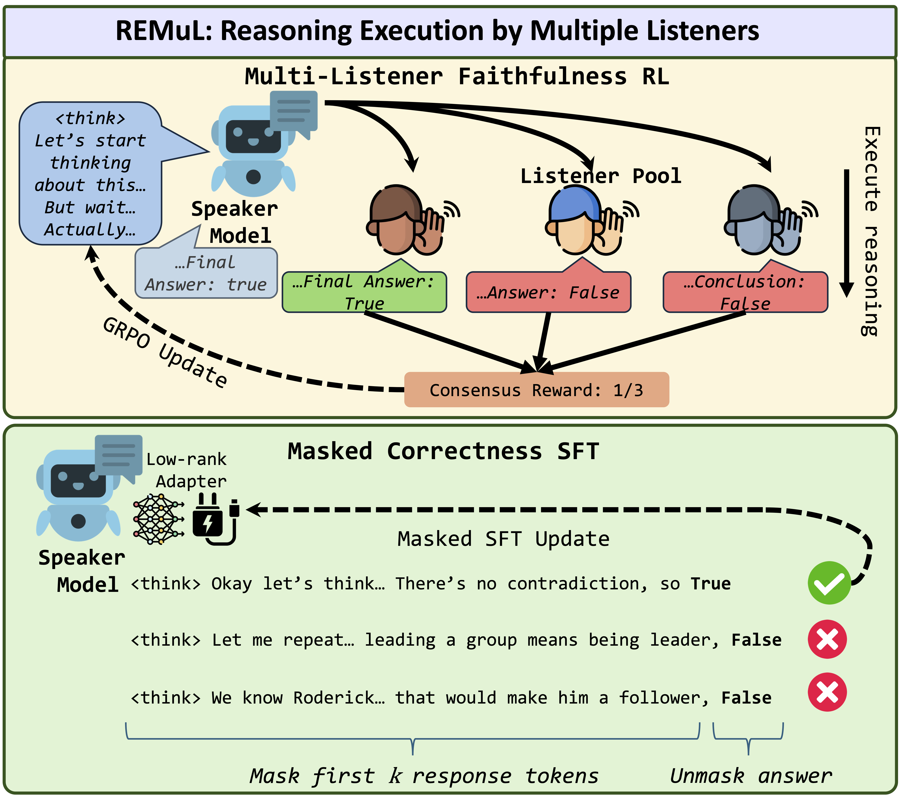

# Balancing Faithfulness and Performance in Reasoning via Multi-Listener Soft Execution

[](https://arxiv.org/abs/2602.16154)
[](https://opensource.org/licenses/MIT)

[Nithin Sivakumaran](https://nsivaku.github.io/) | [Shoubin Yu](https://yui010206.github.io/) | [Hyunji Lee](https://amy-hyunji.github.io/) | [Yue Zhang](https://zhangyuejoslin.github.io/) | [Ali Payani](https://www.linkedin.com/in/ali-payani-59267515/) | [Mohit Bansal](https://www.cs.unc.edu/~mbansal/) | [Elias Stengel-Eskin](https://esteng.github.io/)


Figure: REMUL consists of two components: (Top) A speaker-listener reasoning execution reward, where listeners execute reasoning prefixes from a speaker, who is rewarded for listener consensus. The speaker’s final answer is only used for reward computation and not seen by the listeners. (Bottom) A masked supervised finetuning step to maintain correctness via a LoRA adapter, with loss computed only on answer tokens.

## Installation
We create an environment with Python 3.10 and install the required packages.

```bash
conda create --name remul python=3.10
conda activate remul
pip install -r requirements.txt
```

Additionally, install [verl](https://github.com/verl-project/verl) from source following the instructions in the repository.

## Datasets

1. Training data will be automatically set up and configured.
2. To set up evaluation datasets, run `python data/create_eval_data.py`.
3. Within the `data/` directory, you will now find the training and validation data parquet files as well as JSON files for all evaluation datasets.

## Training

**Stage 1 Training:** To run the multi-party training with listeners, we first the run the faithfulness training with matching rewards. We define multiple reward functions with correctness-only, faithfulness-only, or balanced reward. Running the below file with automatically create training and validation data.

```bash
bash scripts/faithful_training.sh [NUM_GPUS] [OUTPUT_DIR]
```

Within the bash script, you can edit the LISTENER_MODELS by providing a comma-separated list of HuggingFace models and the corresponding model temperatures.

Set the number of GPUs and output directory path through command line arguments.

**Stage 2 Training:** To apply the masked SFT training on the faithful chckopnt, we run the following bash script.

```bash
bash scripts/masked_sft.sh [NUM_GPUS] [MODEL_PATH] [OUTPUT_DIR]
```

Set the number of GPUs, model path, and output directory path through command line arguments.

## Evaluation

Run evaluation with `evaluation/evaluate.py`. Ensure evaluation datasets are set up via `python data/create_eval_data.py` first.

```bash
python evaluation/evaluate.py --model_path MODEL_PATH --dataset DATASET --metric METRIC [OPTIONS]
```

**Required arguments:**
- `--model_path`: Path to the model checkpoint
- `--dataset`: One of `bbeh`, `zlb`, `musr`, `folio`
- `--metric`: One of `accuracy`, `hint_usage`, `truncated_cot_aoc`, `adding_mistakes_aoc`

**Optional arguments:**
- `--temperature` (default: 0.7)
- `--max_new_tokens` (default: 8192)
- `--device` (default: 0)

**Metrics:**
- **accuracy**: Standard answer correctness
- **hint_usage**: Fraction of hint-induced answer changes that are attributed to the hint in the model’s reasoning
- **truncated_cot_aoc**: Area-over-curve of accuracy when reasoning is truncated at varying lengths; measures robustness to truncated chains
- **adding_mistakes_aoc**: Area-over-curve when mistakes are injected at varying positions; measures sensitivity to early errors

Results are saved to `results/{dataset}_{metric}_{model_path}.json`.

## Citation

```bibtex
@article{sivaku2025dart,
      title={Balancing Faithfulness and Performance in Reasoning via Multi-Listener Soft Execution}, 
      author={Nithin Sivakumaran and Shoubin Yu and Hyunji Lee and Yue Zhang and Ali Payani and Mohit Bansal and Elias Stengel-Eskin},
      journal={arXiv preprint arXiv:2602.16154},
      year={2026}
}
```
